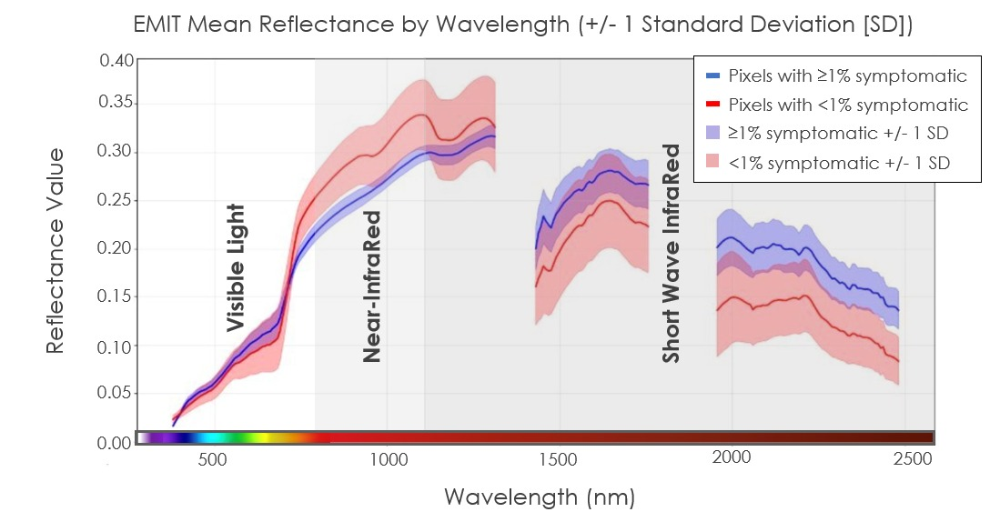
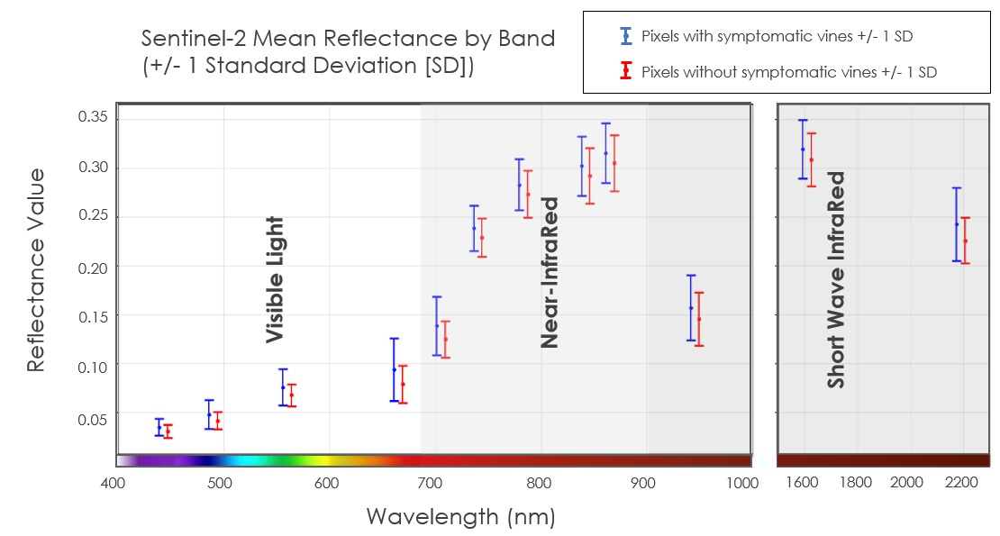
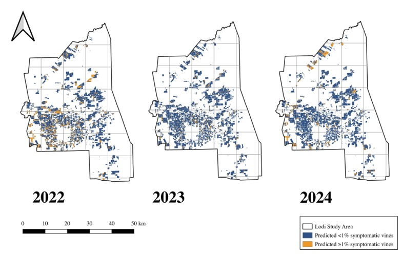

## <b>Summary:</b>

This project from the Fall 2025 NASA DEVELOP term was conducted in partnership with the Lodi Winegrape Commission, NASA Acres, and the Gold Lab at Cornell University to develop and test a scalable grapevine virus (GLRaV-3) detection model using Earth observations. The team developed a random forest classification model using hyperspectral imagery from EMIT and multispectral imagery from Sentinel-2 MSI to classify vineyard areas based on the presence of virus symptoms. The EMIT-based model showed greater sensitivity to areas with higher densities of symptomatic vines than the Sentinel-2 model, suggesting that hyperspectral data may be more suitable for detecting virus symptoms. These findings indicate that spectral resolution may be more critical than spatial resolution for this application.

 

  <figure class="flex w-1/2">
    
  </figure>
  <figure class="flex w-1/2">
    
  </figure>

 

The team assessed how and where the spectral signatures might differ between areas with high and low infection. EMIT shows a clear difference between high- and low-infection areas, while Sentinel-2 shows only subtle, overlapping differences, limiting its ability to reliably distinguish between infection levels.

 

 

EMIT random forest model predictions for GLRaV-3 symptomatic classes. Model predictions were made by applying the best performing random forest model to PCA-transformed EMIT imagery of Lodi vineyards from August and September, 2022–2024.

 

<b>Team:</b> Audrey Chin, Noah Larkin, Derek Gonzalez, Monica Napoles Serrano, [Kathleen Miller (Lead)](DEPLOYMENT_URL)

<b>Paper:</b> [https://ntrs.nasa.gov/citations/20250011141](https://ntrs.nasa.gov/citations/20250011141)

<b>Presentation:</b> [https://ntrs.nasa.gov/citations/20250010829](https://ntrs.nasa.gov/citations/20250010829)
